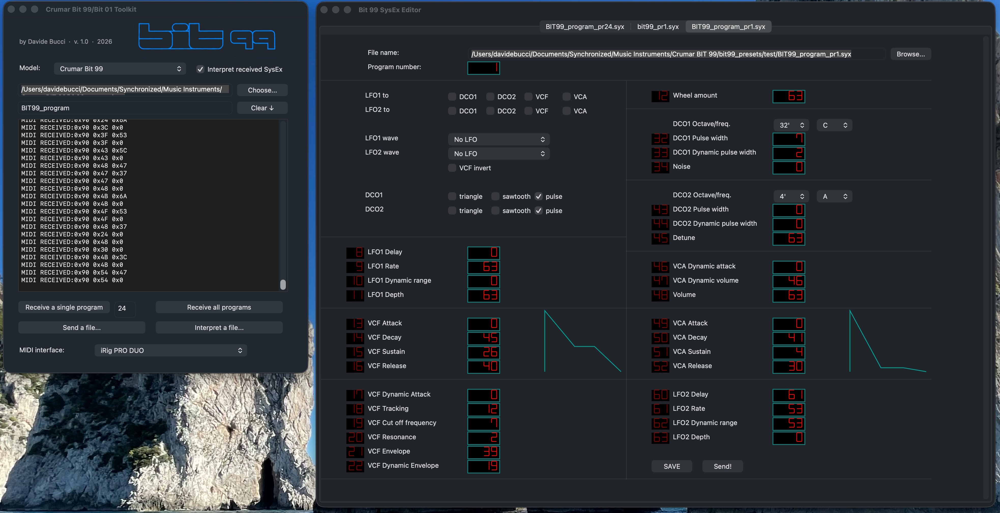
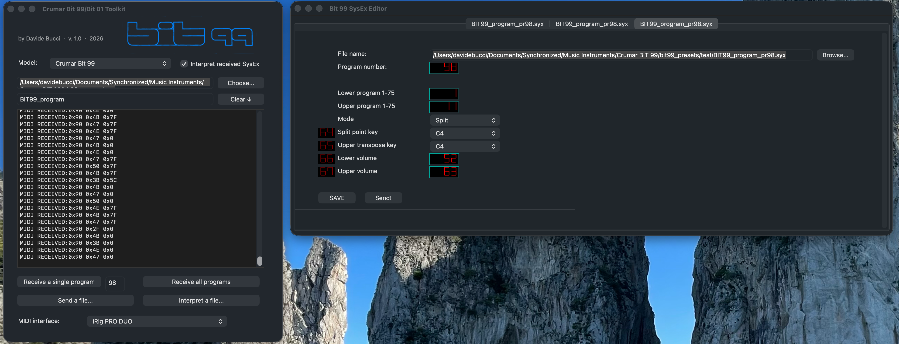

# Bit99Tool

A lightweight macOS editor and MIDI utility for the **Crumar Bit 99** synthesizer.

Bit99Tool provides tools for working with Bit 99 SysEx data and MIDI, including an interactive editor for synthesizer programs.

The project is written in **C and Objective-C** using native macOS Cocoa and CoreMIDI APIs. It has no external runtime dependencies.

## Features

* Send and receive Bit 99 SysEx data via MIDI
* Process and save Bit 99 program dumps
* Interactive SysEx program editor
* Edit individual Bit 99 parameters directly from the graphical interface
* Support for the original Bit 99 program format
* Support for the Bit 99 firmware by Tauntek
* Native macOS graphical interface
* Lightweight and fast

## Screenshots




## Requirements

* macOS
* A MIDI interface connected to a Crumar Bit 99
* Xcode Command Line Tools, or a working C/Objective-C development environment providing Apple's Cocoa and CoreMIDI frameworks

The application is currently developed and tested on modern Intel and Apple Silicon versions of macOS.

## Building

Clone the repository and build the application with:

```sh
make
```

The resulting application can then be launched normally from macOS.

To remove the compiled files:

```sh
make clean
```

## MIDI

Bit99Tool uses Apple's **CoreMIDI** framework to communicate with MIDI devices.

The MIDI destination is selected from the devices currently available to macOS. If a MIDI interface or synthesizer is connected after launching the application, restarting Bit99Tool may be necessary before it appears in the MIDI device list.

## SysEx Editor

The SysEx editor allows the parameters contained in a Bit 99 program dump to be viewed and modified directly.

Parameter values are displayed and edited using controls appropriate to the parameter type. Changes are written back to the program data and can subsequently be saved as a SysEx file.

Bit99Tool can also be used with the Bit 99 running the **Tauntek firmware**.

## Included Font

The graphical editor uses **DSEG7 Classic** for displaying numerical values in a seven-segment style.

The font is included in the `res` directory together with its license:

```text
res/dseg7-classic-latin-300-normal.ttf
res/LICENSE_dseg7
```

Please refer to `LICENSE_dseg7` for the font's licensing terms.

## Project Structure

```text
.
├── Info.plist
├── Makefile
├── res/
│   ├── bit_logo.png
│   ├── dseg7-classic-latin-300-normal.ttf
│   └── LICENSE_dseg7
├── screenshots/
└── src/
```

## License

Bit99Tool is free software: you can redistribute it and/or modify it under the terms of the **GNU General Public License as published by the Free Software Foundation, version 3**.

Bit99Tool is distributed in the hope that it will be useful, but **without any warranty**; without even the implied warranty of **merchantability or fitness for a particular purpose**. See the GNU General Public License for more details.

A copy of the GNU General Public License version 3 should be included in the `LICENSE` file in this repository.

The DSEG7 Classic font is distributed under its own license. See `res/LICENSE_dseg7`.

## Status

Bit99Tool is an ongoing personal project developed for working with the Crumar Bit 99.

The application is functional, but the interface and feature set may continue to evolve.

---

*Built for the Bit 99.*
